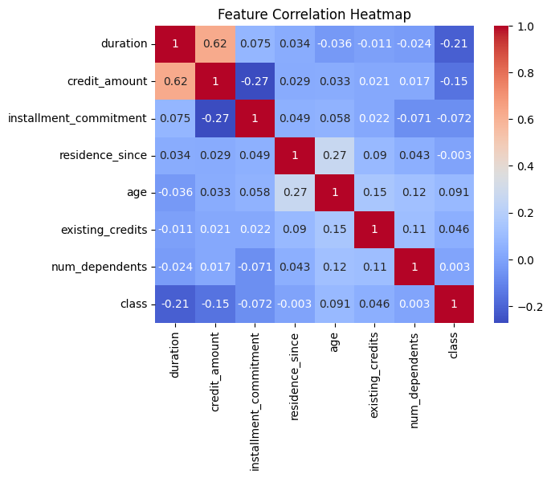
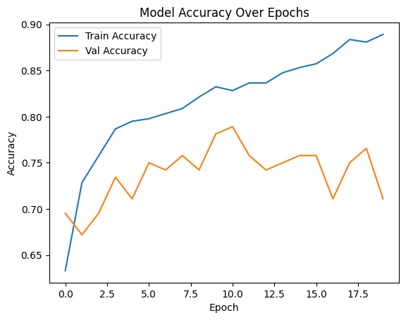
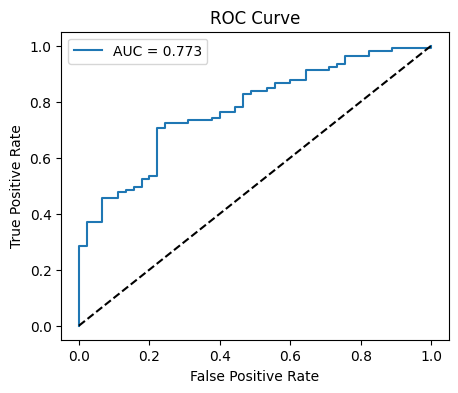
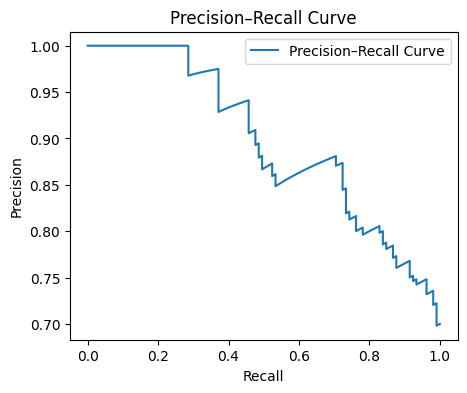

# Documentation

## Data analysis

- Dataset has 1000 samples and 21 features.
- Target variable (class) is imbalanced (70% good, 30% bad).
- The most correlated features to "class" are: credit_amount and duration (excluding categorical features)
- Categorical variables may need encoding later
- Missing values not found




## Data preprocessing, normalization and data split

- Input-output split is done (chose class variable as output)
- Categorical variables encoded (now have 48 features instead of 20)
- Numerical features normalized (with StandardScaler)
- Train-test split is done (train: 85%, test: 15%)

## Configuration

- Configured the base model, ran and visualized it



## Experiment tracking

- Initialized experiment log and experiment definition function
- Run the baseline experiment again to demonstrate its functionality
- The experiment definition function has the following features to choose frome
  - Name
  - Hidden Layers
  - Optimizer Function (Adam or SGD)
  - Learning Rate
  - Batch Size
  - Epochs
  - Dropout Rate (0 if no dropout)
  - Batch Normalization Technique (use or not)

## Experiments

- Ran Several Experiments and Recorded my thoughts
- Came to conclution that i need to use dropout to prevent overfitting

## Hyperparameter search (random)

- Used random search
- Ran 50 experiments
- Found the following experiment to be the best:
  - 3 Hidden Layers: 128, 64, 32
  - Optimizer: SGD
  - Learning Rate: 0.01
  - Batch Size: 64
  - Dropout Rate: 0.30
  - Without Batch Normalization

## Results and evaluation metrics

```
Classification Report:
              precision    recall  f1-score   support

           0      0.571     0.533     0.552        45
           1      0.806     0.829     0.817       105

    accuracy                          0.740       150
   macro avg      0.688     0.681     0.684       150
weighted avg      0.735     0.740     0.737       150
```






## Conclusion

The final model achieves:

- Balanced training and validation performance (no major overfitting)
- Strong AUC and recall, suitable for imbalanced datasets

Still, misclassifies some risky (bad) borrowers

